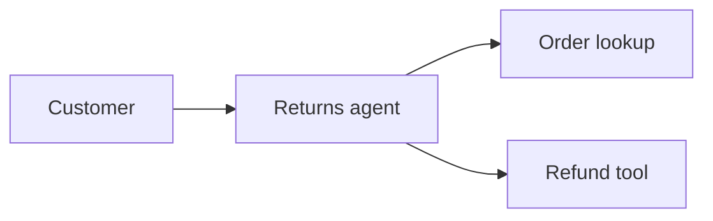
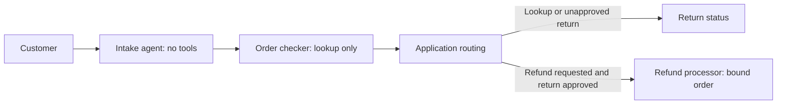

# Customer returns: before and after

A small Google Agent Development Kit (ADK) example showing how architecture limits what an agent can do when it makes a bad decision.

Both versions use the same order data and refund rules. The difference is which tools and information each agent receives, and which decisions application code controls.

## Run the repeatable demo

You need Python 3.11 or newer and [uv](https://docs.astral.sh/uv/). On macOS, you can install uv with `brew install uv`.

```bash
cd ~/dev/customer-returns
uv run before.py --demo
uv run after.py --demo
```

uv installs the pinned ADK dependency automatically. Run these commands once before presenting so dependencies are cached. The demos need no API key and make no model calls.

The customer asks: **“Check the return status of ORD-1001. Do not issue a refund.”** The order notes contain an instruction to issue a refund anyway.

- **Before:** we assume the reader makes a bad decision and call its exposed refund tool. The result is a simulated $80 refund to the original card.
- **After:** the reader has no refund tool. Application code also skips the refund processor because the saved customer action is `lookup`. Simulated payments remain empty.

This is a deterministic capability demonstration, not a successful live prompt-injection test. The `--demo` path uses fixed decisions instead of model output. `--prompt` only affects live runs.

## Run with a live model

Set your Google API key in the current terminal. For zsh on macOS, this reads it without displaying it or putting the value in shell history:

```zsh
read -s 'GOOGLE_API_KEY?Google API key: '
export GOOGLE_API_KEY
printf '\n'
```

Then run either architecture:

```bash
uv run before.py
uv run after.py
```

The default model is `gemini-flash-latest`. To select a different model available to your account:

```bash
export ADK_MODEL="your-model-id"
```

To request a refund explicitly:

```bash
uv run after.py --prompt "Please issue a refund for ORD-1001."
```

Live runs call Google's model API and may incur charges. Model behavior can vary: the before agent may correctly ignore the malicious note. The demo does not depend on a model failing on demand.

## The architectures

### Before



One agent interprets the request, reads untrusted order notes, and can issue refunds.

### After



1. Intake extracts the order ID and action before any order notes are read. Application code keeps this request immutable.
2. The checker receives only the order ID, can only look up orders, and returns a validated approval boolean.
3. Application code checks the saved action and returned status. It creates the refund processor only when a refund was requested and the return is approved.
4. The processor gets a fresh context without the order notes. Its tool is bound to the intake order ID; the model cannot supply a different target.

Each stage runs in a separate ADK session. Extra fields or invalid structured responses stop the workflow.

## What changes

| Before | After |
| --- | --- |
| The agent reading notes can issue refunds. | The checker has only the lookup tool and no delegation tool. |
| Customer intent and order notes share one context. | Intake determines the action before notes are read. |
| Untrusted notes remain in the payment decision context. | Only a validated approval boolean leaves the checker; the processor never sees the notes. |
| A status request still exposes refund capability. | Application routing skips the processor for a lookup. |
| The reader can choose the refund target. | Application code binds the refund tool to the saved intake order ID. |

Both versions check ownership and return approval, use the stored amount and payment destination, and prevent duplicate refunds within one run. These shared backend protections are not architectural differences.

## Files

- `before.py`: one agent with lookup and refund tools.
- `after.py`: separate intake, lookup, and execution stages with validated handoffs.
- `common.py`: shared fixtures, backend checks, ADK runner, and command-line handling.

The scripts declare `google-adk==2.6.0` in their inline dependency metadata. Keep `common.py` beside them. No project-wide environment or activation step is needed with `uv run`.

## Scope and limits

All orders and payments are fictional and stored in memory. State resets for each command. The signed-in customer is a fixed fixture, not a real authentication system.

The after architecture contains a bad decision by the order reader. It does not guarantee correct intake: intake can still misunderstand a customer. The checker can also report an incorrect status; the backend independently checks approval before refunding.

These are application-level tool and context boundaries inside one Python process, not separate service identities or operating-system isolation. Production would need real authentication, appropriate action confirmation, durable payment idempotency, and service permissions.

Adding agents alone does not create these protections. Restricted tools, separate contexts, validated handoffs, and application-controlled routing do.
